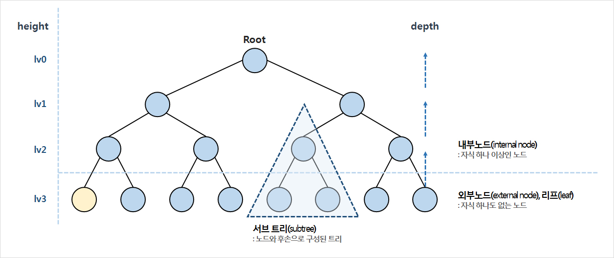

# 8. 트리(tree) 

- 비순차적 자료 구조
- 계층 구조(hierarchical structure)를 추상화한 모델
- ex. 가계도, 조직도 등

## 트리 용어

- 노드 : 트리의 원소
- 루트(Root) : 트리 내 최상위 노드
- 내부 노드 (internal node) : 자식노드가 하나 이상인 노드
- 외부 노드 (external node) : 자식노드가 없는 노드
- 서브 트리 (subtree) : 노드와 후손으로 구성된 트리
- 노드의 깊이 (depth) : 조상의 개수
- 트리의 높이 (height) : 레벨(level)로 구분하기도 하며, root = 0부터 시작하는 높이

## 이진 트리와 이진 탐색 트리
**이진트리(binary tree)**
- 노드는 좌우에 하나씩 최대 2개의 자식노드를 갖음
- 노드의 삽입, 조회, 삭제를 효과적으로 수행할 수 있어서 컴퓨터 과학에서 폭넓게 사용되고 있음

**이진 탐색 트리(binary search tree)**
- 이진 트리의 변형으로 좌측 자식 노드에는 더 작은 값을, 우측 자식 노드에는 더 큰 값을 들고 있음

### BinarySearchTree 클래스 만들기
```js
function BinarySearchTree () {
  var Node = function(key) {
    this.key = key;
    this.left = null;
    this.right = null;
  }

  var root = null;
}
```

**트리 구현 시 필요한 메서드**
- `insert(키)` : 새 키를 삽입
- `search(키)` : 해당 키를 가진 노드 존재 여부 반환(true/false)
- `inOrderTraverse` : 중위 순회(in-order traverse) 방식으로 트리의 전체 노드 방문
- `preOrderTraverse` : 전위 순회(pre-order traverse) 방식으로 트리의 전체 노드 방문
- `postOrderTraverse` : 후위 순회(post-order traverse) 방식으로 트리의 전체 노드 방문
- `min` : 트리의 최소 값/키 반환
- `max` : 트리의 최대 값/키 반환
- `remove(키)` : 해당 키 삭제


### 트리에 키 삽입하기
```js

function BinarySearchTree () {
  var Node = function(key) {
    this.key = key;
    this.left = null;
    this.right = null;
  }

  var root = null;

  var insertNode = function(node, newNode) {  // 프라이빗 헬퍼 함수
    if (newNode.key < node.key) { // key값 비교,현재 노드보다 작은 경우
      if (node.left === null) { // left 없을 경우,
        node.left = newNode;
      } else { // 있을 경우 재귀 호출
        insertNode(node.left, newNode);
      }
    } else {  
      if (node.right === null) { // right 없을 경우
        node.right = newNode;
      } else { // 있을 경우 재귀 호출
        insertNode(node.right, newNode);
      }
    }
  };
  
  this.insert = function(key) {
    var newNode = new Node(key); // Node instance 생성 및 포인터 초기화

    if (root === null) {  // 추가할 key가 해당 트리 최초의 노드일 경우 root로 세팅
      root = newNode;
    } else {  // 아닐 경우 프라이빗 헬퍼 함수 호출
      insertNode(root, newNode);
    }
  }
}
```

```js
var tree = new BinarySearchTree();
tree.insert(11);
tree.insert(7);
tree.insert(15);
tree.insert(5);
tree.insert(3);
tree.insert(9);
tree.insert(8);
tree.insert(10);
tree.insert(13);
tree.insert(12);
tree.insert(14);
tree.insert(20);
tree.insert(18);
tree.insert(25);
```

## 트리 순회(traversal, 워킹 walking)

- 트리의 모든 노 드 방문하여 각 노드마다 특정 작업 순회하는 것
- 트리를 순회하는 방법에 따라 '중위', '전위', '후위'로 나뉨


### 중위 순회(in-order traversal)
- 이진탐색트리(BST)의 노드를 오름차순, 작은 값에서 큰 값 방향으로 방문
- 트리 정렬 시 사용됨


```js
function BinarySearchTree () {
  var Node = function(key) {
    this.key = key;
    this.left = null;
    this.right = null;
  }

  var root = null;

  var insertNode = function(node, newNode) {  // 프라이빗 헬퍼 함수
    if (newNode.key < node.key) { // key값 비교,현재 노드보다 작은 경우
      if (node.left === null) { // left 없을 경우,
        node.left = newNode;
      } else { // 있을 경우 재귀 호출
        insertNode(node.left, newNode);
      }
    } else {  
      if (node.right === null) { // right 없을 경우
        node.right = newNode;
      } else { // 있을 경우 재귀 호출
        insertNode(node.right, newNode);
      }
    }
  };
  
  this.insert = function(key) {
    var newNode = new Node(key); // Node instance 생성 및 포인터 초기화

    if (root === null) {  // 추가할 key가 해당 트리 최초의 노드일 경우 root로 세팅
      root = newNode;
    } else {  // 아닐 경우 프라이빗 헬퍼 함수 호출
      insertNode(root, newNode);
    }
  }


  // 중위 순회
  var inOrderTraverseNode = function(node, callback) {
    if (node != null) {
      inOrderTraverseNode(node.left, callback);
      callback(node.key);
      inOrderTraverseNode(node.right, callback);
    }
  };

  this.inOrderTraverse = function(callback) { // callback은 노드 방문 시 수행할 작업들
    inOrderTraverseNode(root, callback);
  }
}

```
- BST 구현 알고리즘은 대부분 재귀호출을 사용하므로, 프라이빗 헬퍼 함수를 따로 만들어 node와 callback을 전달함


cf. 방문자패턴(visitor pattern)
- 알고리즘을 객체 구조에서 분리시키는 디자인 패턴
- 참고 사이트 : [wiki-비지터패턴](https://ko.wikipedia.org/wiki/%EB%B9%84%EC%A7%80%ED%84%B0_%ED%8C%A8%ED%84%B4) / [http://leetaehoon.tistory.com/63](http://leetaehoon.tistory.com/63)


### 전위 순회(pre-order traversal)

```js
function BinarySearchTree () {
  var Node = function(key) {
    this.key = key;
    this.left = null;
    this.right = null;
  }

  var root = null;

  var insertNode = function(node, newNode) {  // 프라이빗 헬퍼 함수
    if (newNode.key < node.key) { // key값 비교,현재 노드보다 작은 경우
      if (node.left === null) { // left 없을 경우,
        node.left = newNode;
      } else { // 있을 경우 재귀 호출
        insertNode(node.left, newNode);
      }
    } else {  
      if (node.right === null) { // right 없을 경우
        node.right = newNode;
      } else { // 있을 경우 재귀 호출
        insertNode(node.right, newNode);
      }
    }
  };
  
  this.insert = function(key) {
    var newNode = new Node(key); // Node instance 생성 및 포인터 초기화

    if (root === null) {  // 추가할 key가 해당 트리 최초의 노드일 경우 root로 세팅
      root = newNode;
    } else {  // 아닐 경우 프라이빗 헬퍼 함수 호출
      insertNode(root, newNode);
    }
  }


  // 중위 순회
  var inOrderTraverseNode = function(node, callback) {
    if (node != null) {
      inOrderTraverseNode(node.left, callback);
      callback(node.key);
      inOrderTraverseNode(node.right, callback);
    }
  };

  this.inOrderTraverse = function(callback) { // callback은 노드 방문 시 수행할 작업들
    inOrderTraverseNode(root, callback);
  }

  // 전위 순회
  var preOrderTraverseNode = function(node, callback) {
    if ( node !== null ){
      callback(node.key);
      preOrderTraverseNode(node.left, callback);
      preOrderTraverseNode(node.right, callback);
    }
  };

  this.preOrderTraverse = function(callback) {
    preOrderTraverseNode(root, callback);
  }
}
```