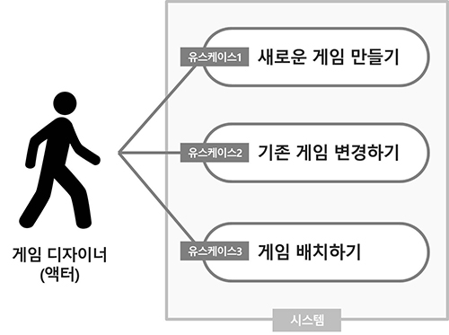

# 6. 정말 큰 문제들 해결하기

## 규모가 큰 프로그램은 어떻게 하죠?  
- **작은 문제를 푼 것과 똑같은 방식으로 큰 문제도 해결합니다**
- 위대한 소프트웨어를 만드는 3단계  
  1. 여러분의 소프트웨어가 고객이 원하는 기능을 하도록 하세요  
  2. 객체지향의 기본 원리를 적용해서 소프트웨어를 유연하게 하세요  
  3. 유주보수와 재사용이 쉬운 디자인을 위해 노력하세요  

## 큰 문제를 어떻게 바라보는 가에 해답이 있습니다.
보통 큰 그림을 먼저 살피고 작은 조을 해결하기 시작하며,  
큰 문제를 기능 별 조각으로 나누고 이를 개별적으로 풀어나가면서 해결합니다.  

## 이미 알고 있는 것들
- **변하는 것을 캡슐화** 하여, 프로그램을 더 유연하고 변경하기 쉽게 만든다  
  \: 캡슐화를 많이 할수록 큰 프로그램을 여러 기능의 조각들로 나누기 쉬워진다  
- 구현에 맞추어 코딩하는 것보다 **인터페이스에 맞추어 코딩하면 소프트웨어의 확장이 더 쉬워진다**  
  \: 이를 통해 모듈 사이의 의존성을 줄일 수 있다(느슨한 결합)  
- **좋은 요구사항을 얻는 가장 좋은 방법은 해야 할 일을 이해하는 것!**
  \: 프로그램의 기능을 구성하는 각각의 작은 조각들이 해야할 일을 안다면, 이를 합쳐 큰 프로그램을 쉽게 만들 수 있다
- **위대한 소프트웨어는 변경과 확장이 쉽고 고객이 원하는 일을 합니다**  
  \: 프로그램이 응집도가 높을수록, 기능의 각 조각들은 더 독립적이고, 그래서 한번에 한 조각씩 해결하는 것이 더 쉬워진다

- **분석은 시스템이 실세계에서 잘 동작하도록 만드는 데 도움이 됩니다**  
  \: 기능별 조각 분석 후, 각 조각들의 상호작용 분석하는 것부터 시작  

> **게리 게임즈 비전 기술서**  
> - 게리 게임즈 는 턴-기반 전략 보드 게임 만드는 데 사용하는 프레임웍 제공  
> - **전략과 전술에 관한 기술적 세부 내용에 중점**  
> - 게임 디자인에 필요한 반복적 코딩을 없애고 개별 게임을 쉽게 만드는 데 필요한  게임 관리도구 제공  
>   \: 프레임웍 제공 통해 게임 개발에 드는 시간과 노력 단축 목표  
> - 게임시스템 프레임웍은 게리 게임즈에서 만드는 모든 게임들의 핵심 모듈 제공  
>   (회사 내 게임 개발 프로젝트에 모두 사용할 수 있도록 API형태 라이브러리로 제공)
> - 제공할 기능
>   - 보드의 환경을 정의/표현  
>   - 부대를 정의하고 군대 또는 다른 전투 유닛들의 환경 설정함  
>   - 보드에서 유닛들을 이동 시킴  
>   - 유닛이 이동 가능한지 판별함  
>   - 전투 수행함  
>   - 유닛의 정보 제공함  

## 어떤 것부터 시작해야 할까요??
- 기존 대로라면, **요구사항 & 유스케이스 작성 > 시스템 개발**  
  \: 시스템이 해야 할 일 알 수 있고, 리스트 순서대로 기능 추가 가능  
   : (여러 개의 작은 문제들을 해결하여, 하나의 큰 문제 해결)

- **하지만 지금은, 충분한 정보가 부족합니다**
  \: 비전 기술서엔 해석이 애매한 부분이 많음
  : 보드게임의 종류, 진짜 고객이 누구인지(게임 플레이어vs.게임 디자이너), 게임 상황 설정 내용 등 부족한 정보가 많음

## 더 많은 정보가 필요해요 - 시스템이 해야 할 일 알아내기
1. **비슷한 시스템 알아내기 - 공통점**
  : 기존의 알고 있는 시스템 중 개발할 시스템과 비슷하게 기능하거나 동작하는 부분이 있는지 찾기
2. **시스템과 상관없는 것 알아내기 - 차별점**
  : 시스템 개발에서 신경쓰지 않아도 되는 부분 결정할 수 있음

## 특징(feature) 찾아내기

**특징** 이란,
- 시스템이 해야 할 일을 추상적으로 설명한 것  
- 고객과 대화 통해 시스템의 특징 알 수 있음  
- 대개의 경우 하나의 특징에, 이를 충족시키기 위한 여러 요구사항이 나옴  

**개발 시스템에 대한 정보가 적고, 규모가 큰 프로젝트인 경우, '시스템의 특징'부터 시작하는 것이 도움이 됨!!**

> **게리 게임 시스템에 대한 특징**
> - 다양한 타입의 지형 지원  
> - 공상 과학 소설, 판타지 소설 등에 등장하는 가상의 시대 포함, 다양한 시대 지원  
> - 게임의 특성에 맞는 여러 타입의 부대 혹은 유닛 지원  
> - 새로운 작전 수행이나 전쟁 시나리오를 위한 모듈 지원  
> - 각 게임은 사각형의 타일들로 구성된 부드를 가지고 있고, 각 타일은 지형 타입을 가지고 있음  
> - 프레임웍은 누구의 차례인지에 대한 정보를 유지하고 유닛들의 기본적인 움직임 관장함  

**특징과 요구사항**
책에서 특징은 요구사항보다 큰 개념으로 사용되었으며(요구사항이 모여 특징이 됨)  
단어를 사용하는 사람에 따라 비슷한 개념으로 사용되기도 함  
\> **중요한 점은, 특히 규모가 큰 프로젝트에서 개발하는 시스템이 해결해야 할 고수준(hign-level)의 일이 무엇인지 알기 위해 시스템의 특징(또는 요구사항)들을 모을 수 있다는 것!**  

### 바보 같은 질문이란 없습니다

**하나의 특징은 여러 개의 요구사항들로 구성될 수 있음**
- **특징** : 다양한 종류의 지형 지원(큰 개념의 요구사항)
  **요구사항** : 특징 구현을 위한, 기본 지형 타입 정의, 개발자가 기본 지형 타입을 확장할 수 있게하는 기능 제공 등 작은 기능들  

**비슷한 개념으로서의 특징과 요구사항**
- 특징과 요구사항에 공통부분이 많으며, 혼용될 수 있음
- 다양한 시대적 배경 지원(큰 개념), 물도 지형의 타입이 될 수 있게 지원(작은 개념)

**중요한 것은, 트징과 요구사항이 모두 시스템이 해야 할 일이라는 것!**

## 항상 세부 내용은 늦출 수 있을 때까지 최대한 늦추세요
- 유스케이스를 작성할 때, 시스템이 해야 할 일에 대해 자세히 살펴보게 됩니다  
- **유스케이스는 개발 시스템 전체의 큰 그림을 보는 데(무엇을 만들지 파악하는 것) 도움이 되지 않습니다**  

## 여러분은 시스템이 해야 할 일을 알아야 합니다(시스템에 대한 큰 그림이 필요합니다)
- 전체 시스템을 설계하는 단계에서 유스케이스는 너무 세세한 내용을 다루기에 적절하지 않습니다  
- 너무 세세한 내용은 피하면서, 시스템 전체의 큰 그림에 중점을 두어 시스템이 해야 할 일을 알아내는 방법이 필요합니다  

## 유스케이스 다이어그램
- 유스케이스 다이어그램은 자세하진 않지만, 시스템이 하는 모든 내용을 간단하고 읽기 쉬운 형태로 제공합니다  

- 여기서 시스템은 게임 프레임웤, 시스템에 대한 액터는 게임 디자이너입니다
- **액터** 는 시스템과 상호작용하며, 시스템을 이용하기 때문에 박스 밖에 있음(시스템의 일부 x)
- 큰 박스는 **시스템** 을 나타내는 것으로, 박스 내 모든 것은 코드로 작성해야 하지만, 밖의 내용은 신경 안 써도 됨
- 박스 안 타원은 시스템을 사용하는 한의 **유스케이스** 를 나타냅니다

**유스케이스 다이어그램은 시스템에 대한 청사진입니다**  
- 여기서 중요한 것은 시스템 전체에 대한 큰 그림이며, 시스템이 해야하는 기본적인 기능을 나타냅니다  

**특징리스트를 사용하여 유스케이스를 확인하세요**  

### 게임 프레임웍의 특징과 유스케이스 다이어그램 연결짓기
> - 새로운 게임 만들기
>   - 프레임웍은 다양한 타입의 지형 지원함
>   - 프레임웍은 다양한 시대 지원함
>   - 프레임웍은 다야한 유닛 타입 지원함
>   - 프레임웍은 추가 모듈 지원함
>   - 프레임웍은 타입들로 구성된 보드를 제공하고 타일은 지형 타입을 가지고 있음
> - 기존 게임 변경하기
> - 게임 배치하기

- 거의 모든 특징들이 새로운 게임을 만드는 것과 관련 있으며,  
  이 특징들 대부분이 설계 변경의 부분이 될 수 있기 때문에 기존 게임 변경하기에도 연결될 수 있다

> 남은 특징  
> - 프레임웍은 누구의 차례인지에 대한 정보를 유지하고 유닛들의 기본적인 움직임을 관장한다

- 위 내용은 이미 다루어져서 게임디자이너가 직접 상호작용하거나 걱정해야 할 내용이 아님!  
