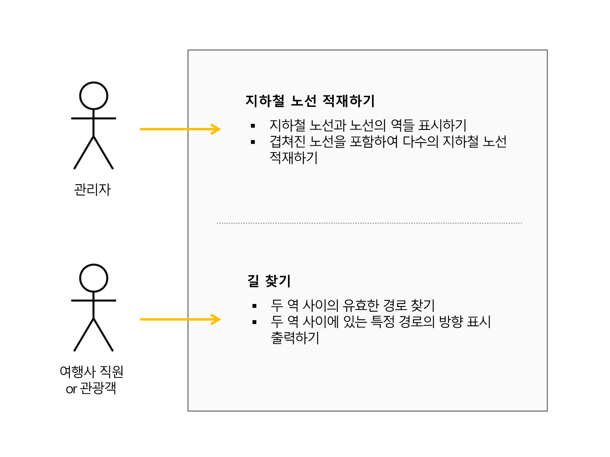

# OOA&D 생명 주기 - 종합하기

## 조각들 모으기 - OOA&D 스타일로 소프트웨어 개발하기
지금까지 다뤘던 개별적인 내용을 종합하는 것이 이 장의 내용입니다.

### OOA&D 프로젝트 생명주기
**1. 여러분의 소프트웨어가 고객이 원하는 기능을 하도록 하세요**
- **특징리스트**
	- 상위 수준에서 애플리케이션이 어떻게 동작되어야 하는지 이해하기
- **유스케이스 다이어그램**
	- 애플리케이션이 수행할 프로세스와 관련된 외부 영향을 결정하기
- **문제점 분해하기**
	- 애플리케이션을 기능단위의 모듈들로 분해하여 각 모듈 중 어떤 것을 먼저 다룰지 순서 정하기  

(반복적 개발)
- **요구사항**
	- 각 모듈에 대한 개별적 요구 사항을 이해하고 큰 그림에 부합하도록 만들기
- **도메인 분석**
	- 어떻게 유스케이스들이 애플리케이션 객체들로 사상되는지를 이해하고 고객과 공감대 형성하기

**2. 객체지향의 기본 원리를 적용해서 소프트웨어를 유연하게 하세요**  
- **사전 설계**
	- 객체들에 대한 세부 내용을 채워 넣고 객체들 사이의 관계를 정의하며, 원리와 패턴 적용하기
**3. 유지보수와 재사용이 쉬운 디자인을 위해 노력하세요**  
- **구현**
	- 코드 작성하고 테스트하여 동작하는 것을 확인하기  
		완성할 때까지 각 행위, 각 특징, 각 유스케이스, 각 문제점에 대해 그렇게 하기
- **출하**
	- 완성!

**이 프로세스를 이용하여 소프트웨어를 처음부터 끝까지 작성해 봅시다**  
특징리스트에서 구현 및 출하까지, 위의 프로세스에 맞춰 소프트웨어를 작성하는 동안, 위대한 소프트웨어를 만드는 것을 익힐 수 있습니다.

## 객체 마을 여행
### 문제
> **작업기술서**
> - 최근 객체마을로의 여행이 증가함에 따라, 관광객에게 객체마을의 독특하며 뛰어난 광경을 쉽게 보여줄 방법을 제공하려 합니다.
> - 여행 길라잡이는 객체마을의 모든 지하철 노선과 각 노선의 모든 역을 저장할 수 있어야 합니다.
> - 객체마을 지하철은 최신식이며, 역 사이를 앞으로 혹은 뒤로도 갈 수 있어, 어떤 노선에서도 방향에 대해 걱정할 필요가 없습니다.
> - 여행 길라잡이는 출발역과 종착역을 선택할 수 있고 운행할 경로를 알아낼 수 있어야 합니다.
> - 여행사 직원은 타야할 노선과 함께 해당 노선이 어떤 역을 지나고 환승역에서 노선을 바꾸어 탈때를 알려주느 경로를 출력할 수 있어야 합니다.

## 연필을 깎으며 - 특징 리스트 작성하기
작업기술서의 내용을 바탕으로 특징리스트를 작성합니다.  

(작성 내용)  
> **객체 지향 마을 여행 길라잡이(Route Finder) - 특징리스트**   
> 1. 여행 길라잡이는 객체마을의 모든 지하철 노선과 각 노선의 모든 역을 저장할 수 있어야 합니다.  
> 2. 역 사이를 앞으로 혹은 뒤로도 갈 수 있어, 어떤 노선에서도 방향에 대해 걱정할 필요가 없습니다.???
> 3. 출발역과 종착역을 선택하여 운행할 경로를 출력
> 4. 사용자는 타야할 노선과 경로를 출력할 수 있어야 합니다.

(책 내용)  
> **객체 지향 마을 여행 길라잡이(Route Finder) - 특징리스트**   
> 1. 지하철 노선과 노선의 역들을 포시할 수 있어야 합니다.
> 2. 겹쳐진 노선을 포함하여 다수의 지하철 노선을 적재할 수 있어야 합니다.
> 3. 모든 노선에서는 임의의 두 역 사이의 유효한 경로를 찾을 수 있어야 합니다.
> 4. 일련의 방향 표시로, 두 역 사이의 경로를 출력할 수 있어야 합니다.

## 바보 같은 질문이란 없습니다
**Q. 특징과 요구사항의 차이**  
- A : 특징과 요구사항은 종종 바꾸어 사용됩니다. 대체로 특징은 요구사항보다 큰 그림으로 하나의 특징을 만족시키기 위해 서너개의 요구사항이 필요할 수도 있습니다.  
	새로운 프로젝트는 특징 리스트 작성부터 시작하는 것이 좋습니다.

**Q. 경로 출력을 별개 특징으로 뽑은 이유**
- A : 이는 두 역 사이의 유효 경로만 찾으면 쉬운 일이지만, 특징 리스트에는 어려운 문제만 나열하지 않습니다. 특징 리스트는 애플리케이션이 할 수 있어야만 하는 모든 것을 나열합니다.

## 이젠 무엇을 해야 하는지 정말로 알아야 합니다
- **특징 리스트는 모두 소프트웨어가 무엇을 해야 하는지 이해하는 것에 대한 것입니다**
- **유스케이스 다이어그램은 불필요한 세부 항목들 속으로 빠져들지 않고, 소프트웨어가 어떻게 사용될 것인지에 대해 생각할 수 있도록 합니다**

가지고 있는 특징 리스트를 이용하여 애플리케이션이 해야 할 일들을 잘 이해하고, 애플리케이션의 구조를 생각해볼 수 있습니다.  
일단 특징리스트의 작성을 마치면 유스케이스 다이어그램 작성으로 넘어가, 애플리케이션이 무엇을 해야 하는지와 어떻게 사용될 수 있는지를 연결해 볼 수 있습니다.

## 유스케이스 다이어그램
### 연필을 깎으며 - 여행길라잡이 코드의 구조를 결정하세요
특징리스트를 활용하여 만든 유스케이스와 각 유스케이스에 해당하는 특징들

### 유스케이스는 "사용법"을 반영하고 "특징"은 기능을 반영합니다
- **유스케이스** 는 액터와의 상호작용을 다루어 시스템이 사용되는 방식을 다루며,  
- **특징** 은 해당 유스케이스를 위해 시스템이 해야할 부분을 의미합니다. 이는 액터와의 상호작용은 아니기 때문에 유스케이스에 포함되지는 않습니다.

**시스템의 특징은 시스템의 "기능"을 나타냅니다. 비록 기능이 항상 어떤 특정 유스케이스의 눈에 드러난 일부는 아니지만, 유스케이스가 실제로 작동하기위해 시스템이 꼭 해야할 것들입니다.**

## 바보 같은 질문이란 없습니다
**Q. 특징과 유스케이스의 연결성**
- A : 시스템의 모든 특징은 적어도 유스케이스 다이어그램에서 한 개 이상의 유스케이스를 집중하고 있습니다. 그러나 유스케이스가 그 특징을 직접적으로 사용해야 한다는 것을 의미하지 않으며, 많은 경우 특징은 유스케이스 자체가 이를 직접 사용하지는 않지만 해당 유스케이스가 작동될 수 있도록 합니다

**Q. 특징과 유스케이스, 어떤 것이 요구사항인지**
- A : 유스케이스는 액터와 시스템의 상호작용에 대한 요구사항이고, 특징은 시스템이 작업해야할 것들에 대한 요구사항입니다. 이 둘은 연관이 있지만 같은 것은 아닙니다.

**Q. 유스케이스와 연결지을 수 없는 특징이 있을 경우**
- A : 특징이 시스템에 정말로 필요한 것인지 판단해야합니다. 고객은 유스케이스를 통해서만 상호작용을 하며, 유스케이스와 연결되지 않은 특징의 경우 고객이 볼 수 없습니다.   
	해당 특징이 반드시 필요한 것이라면 고객과 논의, 그렇지 않으면 잘래내야 합니다.

## 크게 분할하기 - 문제점 분해하기
문제를 작은 단위의 기능으로 나누어, 시스템을 모듈화합니다. 이것은 각 모듈이 하나의 임무를 하게 하는 것을 의미하빈다.

실제 시스템을 구성하는 모듈

- **Subway**  - 지하철 모듈은 역과 각 역사이의 연결, 전체 지하철 시스템을 나타내는 모든 코드를 가지고 있습니다. 그것은 또한 하나의 역에서 또 다른 역으로의 길을 찾는 방법을 알고 있습니다.
- **Loader** - 지하철을 적재하는 여러가지 방법이 -파일로부터, 사용자 입력으로, 데이터베이스로부터- 있습니다. 적재는 실제 지하철을 표시하는 것과는 구분이 됩니다. 그래서 그것은 자신의 모듈을 갖고 있습니다.
- **Printer** - 인쇄는 적재와 매우 비슷하지만, 지하철 시스템 그 자체와는 구별됩니다. 이 모듈은 지하철을 어떤 기기나, 필요한 형식으로 인쇄하는 것을 다룹니다.

테스트 모듈
- 테스트는 시스템의 밖에서 시스템과 상호작용하지만, 시스템의 일부는 아닙니다.
